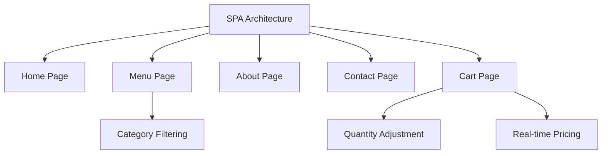

# 🍣 Sushi Shop SPA


A delicious single-page application for ordering fresh sushi online! Built with modern web technologies to provide a seamless ordering experience.

## ✨ Features

- 🍱 **Interactive Menu** - Browse sushi categories with mouth-watering visuals
- 🛒 **Smart Cart** - Add/remove items, adjust quantities in real-time
- 📱 **Fully Responsive** - Perfect experience on any device
- ⚡ **SPA Navigation** - Fast page transitions without reloads
- 📊 **Live Price Calculation** - Instant order total updates
- 🌈 **Modern UI** - Clean design with appetizing visuals

## 🛠️ Technologies Used

- **Knockout.js** - MVVM pattern for reactive UI
- **HTML5 & CSS3** - Semantic markup and responsive design
- **JavaScript ES6** - Modern client-side logic
- **Flexbox & Grid** - Advanced layout techniques
- **CSS Animations** - Smooth transitions and hover effects

## 🚀 Getting Started

### Prerequisites
- Modern web browser (Chrome, Firefox, Safari, Edge)

### Installation
No installation needed! Simply open the HTML file in your browser:

```bash
# Clone the repository
git clone https://github.com/yourusername/sushi-shop-spa.git

# Open the main file
open index.html
```

Or use the live demo: [sushi-shop-demo.com](https://example.com)

## 📂 Project Structure

```
sushi-shop-spa/
├── index.html          # Main application file
├── README.md           # Project documentation
├── assets/             # Resource directory
│   ├── images/         # Food images
│   ├── css/            # Stylesheets
│   └── js/             # JavaScript files
```

## 🧩 Key Components



## 🌐 Live Demo

Experience the app right now:  
[Demo Link](https://your-deployment-link.com)

## 📱 Mobile Experience

  
*Responsive design adapts perfectly to all screen sizes*

## 📸 Screenshots

| Home Page | Menu | Cart |
|-----------|------|------|
|  |  |  |

## 🤝 Contributing

We welcome contributions! Please follow these steps:

1. Fork the project
2. Create your feature branch (`git checkout -b feature/AmazingSushi`)
3. Commit your changes (`git commit -m 'Add some AmazingSushi'`)
4. Push to the branch (`git push origin feature/AmazingSushi`)
5. Open a pull request

## 📜 License

Distributed under the MIT License. See `LICENSE` for more information.

## 📬 Contact

Sushi Team - [sushi@example.com](mailto:sushi@example.com)  
Project Link: [github.com/yourusername/sushi-shop-spa](https://github.com/yourusername/sushi-shop-spa)

## 🎉 Acknowledgments

- Inspiration from real sushi chefs
- Knockout.js community
- All the sushi lovers who tested our app!

---

Made with ❤️ and 🍣 by the Sushi Shop Team